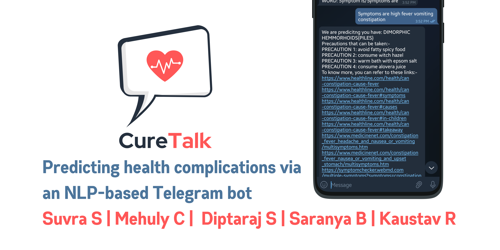
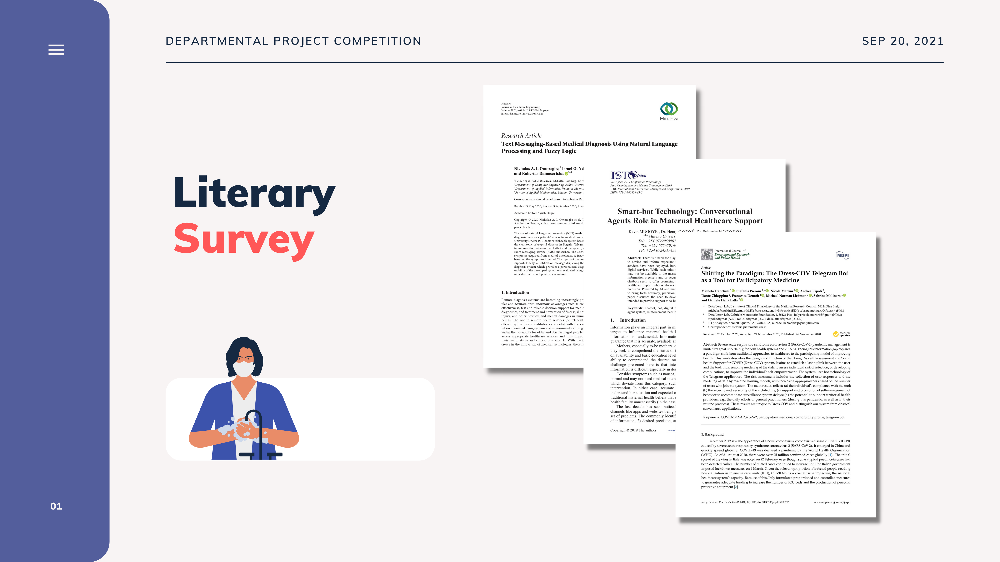

# CureTalk   

Over the last decade, scientific discovery and technological advances have created great anticipation for capabilities to tailor individual medical decisions and provide personalized healthcare. Despite some advances, the COVID-19 pandemic has reminded us time and again how without proper assistance and guidance from healthcare professionals, one may encounter some terrible consequences.

### Why CureTalk?

- **Lack of knowledge** - Patients often underestimate their symptoms. Even for multiple symptoms, people often misjudge it for a different disease than it actually is.
- **Lack of adequate healthcare facilities** - Healthcare in India is unevenly distributed. Hence, users can check their condition through the app and act accordingly. This reduces panic and confusion.
- **Unpromising chatbots** - Patients find it more comfortable if they were to speak out about their problems, like with a conventional doctor. Most chatbots offer an MCQ model and hence confuses the users. Also, an NLP system is scalable for different demographics in the future.

### About CureTalk:

- **\start & \help** - We used the Botfather API token and integrated it into py-telegram-bot so that we can implement commands using python.
- **\symptoms** - We have used the NLTK library for processing the user input. Then, we have also matched the extracted symptoms into the CSV.
- **\hospitals** - The py-gsearch has been used for looking for nearby hospitals as the user wants. This is just one of the prospects for our project in future.
